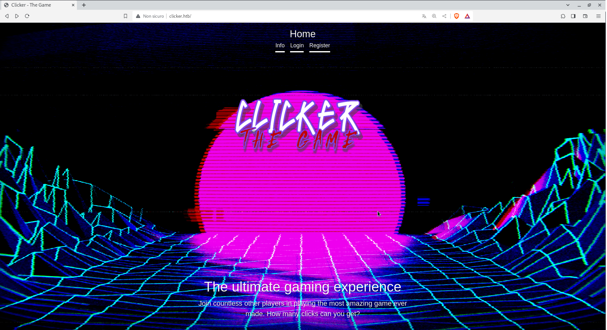

we start the machine with the classic port scan:
	
	rustscan -a 10.10.11.232
output:
	
	PORT      STATE SERVICE  VERSION
	22/tcp    open  ssh      OpenSSH 8.9p1 Ubuntu 3ubuntu0.4 (Ubuntu Linux; protocol 2.0)
	| ssh-hostkey: 
	|   256 89:d7:39:34:58:a0:ea:a1:db:c1:3d:14:ec:5d:5a:92 (ECDSA)
	|_  256 b4:da:8d:af:65:9c:bb:f0:71:d5:13:50:ed:d8:11:30 (ED25519)
	80/tcp    open  http     Apache httpd 2.4.52 ((Ubuntu))
	|_http-title: Clicker - The Game
	| http-cookie-flags: 
	|   /: 
	|     PHPSESSID: 
	|_      httponly flag not set
	|_http-server-header: Apache/2.4.52 (Ubuntu)
	111/tcp   open  rpcbind  2-4 (RPC #100000)
	| rpcinfo: 
	|   program version    port/proto  service
	|   100003  3,4         2049/tcp   nfs
	|   100003  3,4         2049/tcp6  nfs
	|   100005  1,2,3      40233/tcp6  mountd
	|   100005  1,2,3      48385/udp6  mountd
	|   100005  1,2,3      50723/tcp   mountd
	|   100005  1,2,3      60844/udp   mountd
	|   100021  1,3,4      38019/tcp   nlockmgr
	|   100021  1,3,4      41941/udp6  nlockmgr
	|   100021  1,3,4      42255/tcp6  nlockmgr
	|   100021  1,3,4      55989/udp   nlockmgr
	|   100024  1          37467/udp6  status
	|   100024  1          46575/udp   status
	|   100024  1          48289/tcp6  status
	|   100024  1          53843/tcp   status
	|   100227  3           2049/tcp   nfs_acl
	|_  100227  3           2049/tcp6  nfs_acl
	2049/tcp  open  nfs_acl  3 (RPC #100227)
	38019/tcp open  nlockmgr 1-4 (RPC #100021)
	50723/tcp open  mountd   1-3 (RPC #100005)
	53055/tcp open  mountd   1-3 (RPC #100005)
	53843/tcp open  status   1 (RPC #100024)
	56087/tcp open  mountd   1-3 (RPC #100005)
	Service Info: OS: Linux; CPE: cpe:/o:linux:linux_kernel

we have a a lot of ports here,
While the scan was running in fact i peeked at the webserver on port 80
and found this error (in my language =) ):
	
	Impossibile trovare l'indirizzo DNS di clicker.htb. Stiamo analizzando il problema.

	DNS_PROBE_POSSIBLE
on the host bar appeard:
	
	http://clicker.htb/
so i added the domain name to my hosts:
	
	echo '10.10.11.232	clicker.htb' >> /etc/hosts
so now i can visit the site:
	

	
Meanwhile the scan is over and i can start enumerate the other ports available
(the output above is already after full scan).
We have an interesting nfs that maybe we can mount on our local machine if it is not protected:
	
	showmount -e clicker.htb
with this comand we can see if the nfs has any opened shares
output:
	
	Export list for clicker.htb:
	/mnt/backups *
this means that we can mount this share on our machine like this:
	
	mkdir ~/htb/clicker/mount
	sudo mount -t nfs clicker.htb:/mnt/backups ~/htb/clicker/mount
now we can check what's inside the nfs:
	
	-rw-r--r-- 1 root   root    2284115  1 set 22.27 clicker.htb_backup.zip
the file system is in read-only mode so i copied the file outside where i unzipped it:
	
	cp clicker.htb_backup.zip ~/htb/clicker/
	unzip ~/htb/clicker/clicker.htb_backup.zip
output:
	
	drwxr-xr-x 4 kali kali 4096  1 set 22.21 .
	drwxr-xr-x 5 kali kali 4096 25 set 22.50 ..
	-rw-rw-r-- 1 kali kali 3934  1 set 22.18 admin.php
	drwxr-xr-x 4 kali kali 4096 28 feb  2023 assets
	-rw-rw-r-- 1 kali kali  608  1 set 22.17 authenticate.php
	-rw-rw-r-- 1 kali kali  541  1 set 22.17 create_player.php
	-rw-rw-r-- 1 kali kali 2536  1 set 22.18 db_utils.php
	-rw-r--r-- 1 kali kali 1376  1 set 22.18 diagnostic.php
	-rw-rw-r-- 1 kali kali 1977  1 set 22.18 export.php
	drwxr-xr-x 2 kali kali 4096  1 set 22.18 exports
	-rw-rw-r-- 1 kali kali 3887  1 set 22.18 index.php
	-rw-rw-r-- 1 kali kali 3423  1 set 22.18 info.php
	-rw-rw-r-- 1 kali kali 3301  1 set 22.18 login.php
	-rw-rw-r-- 1 kali kali   74  1 set 22.17 logout.php
	-rw-rw-r-- 1 kali kali 3341  1 set 22.17 play.php
	-rw-rw-r-- 1 kali kali 3070  1 set 22.17 profile.php
	-rw-rw-r-- 1 kali kali 3333  1 set 22.18 register.php
	-rw-rw-r-- 1 kali kali  563  1 set 22.18 save_game.php
so basically this is the backup of the web server so we can take a look at the source code and search for vulns.
